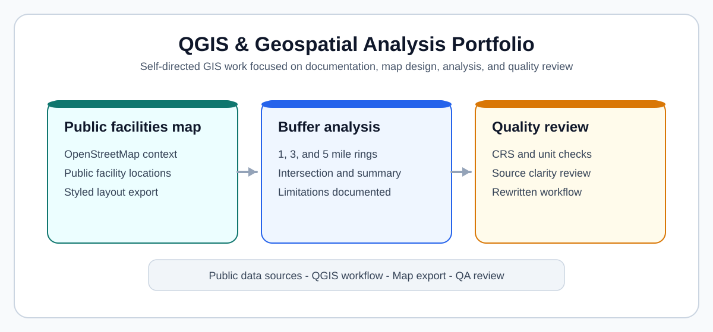

# QGIS & Geospatial Analysis Portfolio

This repository contains self-directed GIS portfolio pieces created to demonstrate how I document QGIS-style workflows, organize spatial data, approach map design, and review AI-generated GIS guidance. It is not presented as client work.

## Visual overview

## What this portfolio demonstrates

- QGIS workflow documentation
- Spatial data organization
- Layer styling and map composition
- Buffer and distance analysis concepts
- GIS quality review
- Metadata and data-source documentation
- AI-generated GIS output evaluation

## Projects

1. [Huntsville Public Facilities Map](projects/01-huntsville-public-facilities-map/README.md) - open-data map workflow with public facilities and context layers.
2. [Service Area / Buffer Analysis](projects/02-service-area-buffer-analysis/README.md) - accessibility concept using 1-, 3-, and 5-mile buffers.
3. [GIS Quality Review](projects/03-gis-quality-review/README.md) - review of an AI-generated QGIS answer with a corrected version.

## How this relates to QGIS/GIS quality evaluation

These pages emphasize reproducibility, projection awareness, data-source transparency, unit handling, and limitation statements. Those are the same checks needed when judging whether a QGIS instruction, dataset, or map output is credible and safe to use.

## Tools and concepts

- QGIS
- OpenStreetMap and other public GIS datasets
- CRS selection and projected coordinate systems
- Layer styling, labeling, and layout composition
- Buffer, clip, intersect, and select-by-location tools
- Metadata, lineage, and documentation discipline
- Manual QA and edge-case review

## Contact

GitHub: https://github.com/onehermes
